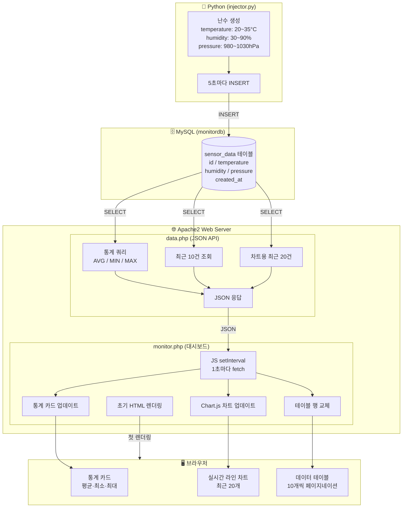
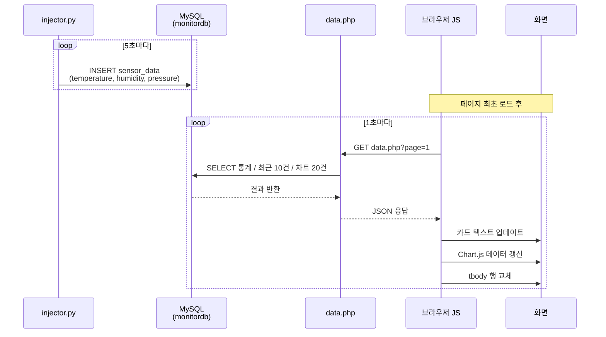

# LAMP Stack 실시간 센서 모니터링 시스템

> Linux + Apache + MySQL + PHP + Python 으로 구축한 실시간 IoT 데이터 모니터링 플랫폼

---

## 목차

1. [프로젝트 개요](#1-프로젝트-개요)
2. [기술 스택](#2-기술-스택)
3. [전체 시스템 블럭도](#3-전체-시스템-블럭도)
4. [디렉토리 구조](#4-디렉토리-구조)
5. [데이터베이스 스키마](#5-데이터베이스-스키마)
6. [구성 요소 상세](#6-구성-요소-상세)
7. [데이터 흐름도](#7-데이터-흐름도)
8. [구축 순서](#8-구축-순서)
9. [실행 방법](#9-실행-방법)

---

## 1. 프로젝트 개요

| 항목 | 내용 |
|------|------|
| 운영체제 | Zorin OS (Ubuntu 기반) |
| 목표 | 가상 센서 데이터를 MySQL에 저장하고 PHP로 실시간 웹 모니터링 |
| 갱신 주기 | 1초 (JavaScript fetch polling) |
| 센서 항목 | 온도(°C), 습도(%), 기압(hPa) |

---

## 2. 기술 스택

| 레이어 | 기술 | 역할 |
|--------|------|------|
| OS | Linux (Zorin OS) | 서버 운영체제 |
| Web Server | Apache2 | HTTP 요청 처리 |
| Database | MySQL 8.0 | 센서 데이터 저장 |
| Backend | PHP 8.3 | 동적 HTML 생성 / JSON API |
| Data Generator | Python 3.12 | 가상 센서 데이터 주입 |
| Frontend | Chart.js | 실시간 라인 차트 |

---

## 3. 전체 시스템 블럭도



---

## 4. 디렉토리 구조

```
Desktop/myspl_php/
├── injector.py          ← 가상 센서 데이터 생성 및 MySQL 저장
├── main.py              ← humid 단일값 저장 (초기 테스트용)
├── mongodb-test.py      ← MongoDB 저장 테스트 (shkimdb.sensor)
├── process.md           ← 이 문서
└── README.md

/var/www/html/
├── monitor.php          ← 실시간 모니터링 대시보드
├── data.php             ← 1초 갱신용 JSON API 엔드포인트
└── test-php-mysql.php   ← sensor 테이블 humble 단순 조회 페이지

/var/www/html/auth/      ← 로그인/회원가입 시스템 (별도 프로젝트)
├── login.php
├── register.php
├── dashboard.php
└── ...
```

---

## 5. 데이터베이스 스키마

### MySQL — monitordb

```sql
CREATE DATABASE monitordb CHARACTER SET utf8mb4 COLLATE utf8mb4_unicode_ci;

CREATE TABLE sensor_data (
    id          INT AUTO_INCREMENT PRIMARY KEY,
    temperature FLOAT   NOT NULL COMMENT '온도 (°C)',
    humidity    FLOAT   NOT NULL COMMENT '습도 (%)',
    pressure    FLOAT   NOT NULL COMMENT '기압 (hPa)',
    created_at  DATETIME DEFAULT CURRENT_TIMESTAMP
);
```

### MySQL — jungjudb (초기 테스트)

```sql
CREATE TABLE sensor (
    id         INT AUTO_INCREMENT PRIMARY KEY,
    humid      FLOAT NOT NULL,
    created_at DATETIME DEFAULT CURRENT_TIMESTAMP
);
```

### MongoDB — shkimdb (테스트)

```
Collection: sensor
Document: { humid: <float>, _id: ObjectId }
```

---

## 6. 구성 요소 상세

### injector.py

- `mysql-connector-python` 사용
- 5초마다 `monitordb.sensor_data`에 INSERT
- 생성 범위: temperature 20~35°C, humidity 30~90%, pressure 980~1030hPa

### data.php (JSON API)

- `GET ?page=N` 파라미터로 페이지 지정
- 응답 구조:

```json
{
  "stat": { "avg_temp": 27.5, "min_temp": 20.1, "max_temp": 34.9, ... },
  "rows": [ { "id": 1, "temperature": 27.5, "humidity": 60.2, ... } ],
  "chart": { "labels": ["14:00:01", ...], "temps": [...], "humids": [...], "press": [...] }
}
```

### monitor.php (대시보드)

- 최초 로드 시 PHP로 초기 데이터 렌더링
- 이후 `setInterval(fetch, 1000)` 으로 1초마다 `data.php` 호출
- DOM 직접 업데이트 → 페이지 리로드 없이 실시간 갱신
- Chart.js 라인 차트로 최근 20개 추이 시각화

---

## 7. 데이터 흐름도



---

## 8. 구축 순서

1. **LAMP 스택 확인** — Apache2, MySQL, PHP 설치 및 서비스 실행 확인
2. **DB/테이블 생성** — `monitordb` 데이터베이스 및 `sensor_data` 테이블 생성
3. **injector.py 작성** — 가상 센서 데이터 생성 및 주기적 INSERT
4. **test-php-mysql.php 작성** — sensor 테이블 데이터 10개씩 페이지네이션 조회
5. **data.php 작성** — 통계·테이블·차트 데이터를 JSON으로 반환하는 API
6. **monitor.php 작성** — 초기 렌더링 + JS polling 실시간 대시보드
7. **갱신 주기 변경** — meta refresh(5초) → JS fetch setInterval(1초) 로 전환
8. **mongodb-test.py 작성** — MongoDB shkimdb.sensor에 humid 데이터 저장 테스트

---

## 9. 실행 방법

```bash
# 1. 의존성 설치
pip3 install mysql-connector-python pymongo

# 2. 데이터 주입 시작 (포그라운드 — Ctrl+C로 종료)
python3 ~/Desktop/myspl_php/injector.py

# 3. 브라우저에서 접속
http://localhost/monitor.php          # 실시간 대시보드
http://localhost/test-php-mysql.php   # humid 단순 조회

# 4. 프로세스 종료
pkill -f injector.py
```
