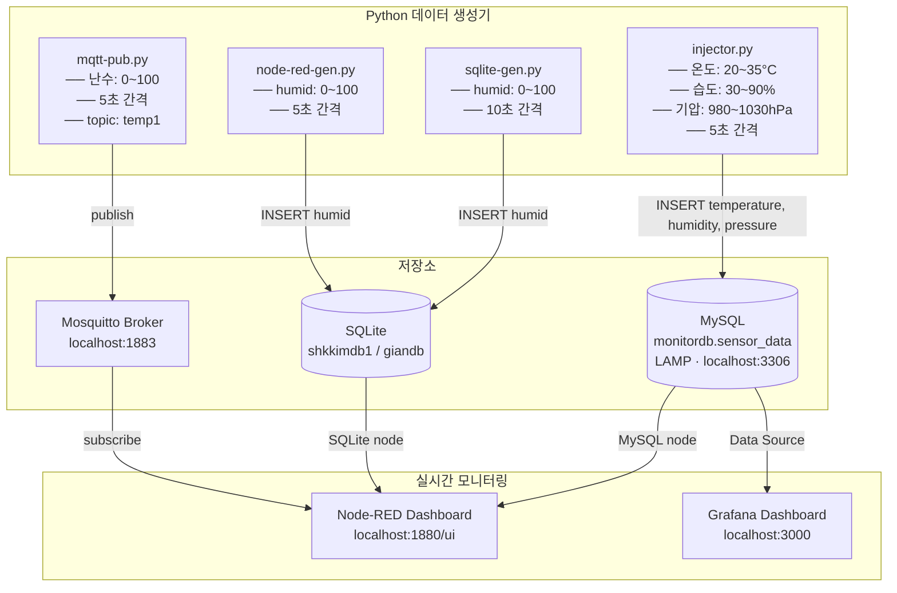
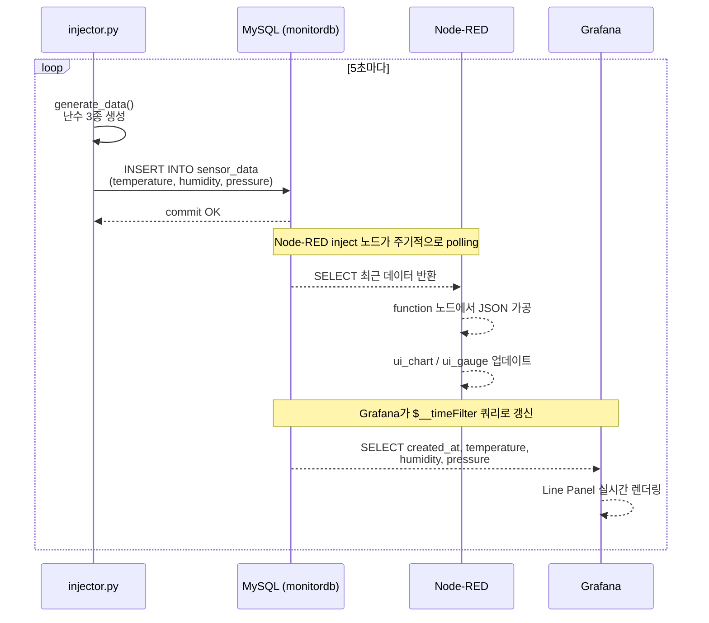
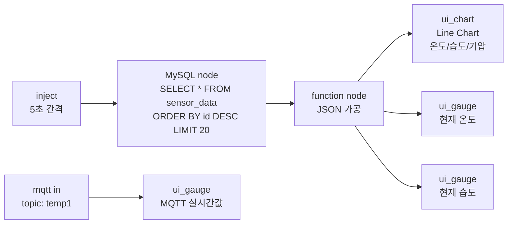
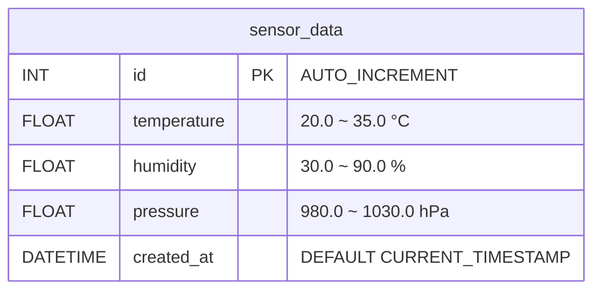

# IoT 센서 데이터 모니터링 프로젝트

## 개요

가상 센서 데이터(온도·습도·기압)를 Python으로 자동 생성하여 MySQL(LAMP)에 저장하고,
Node-RED 및 Grafana 대시보드에서 실시간으로 모니터링하는 시스템입니다.

---

## 구성 요소

| 파일 | 설명 |
|---|---|
| `injector.py` | 5초마다 온도/습도/기압 난수 생성 → MySQL(monitordb) 저장 |
| `node-red-gen.py` | 5초마다 humid 난수 생성 → SQLite(shkkimdb1) 저장 |
| `sqlite-gen.py` | 10초마다 humid 난수 생성 → SQLite(giandb) 저장 |
| `mqtt-pub.py` | 5초마다 난수 생성 → MQTT topic `temp1` publish |
| `setup_db.sql` | MySQL monitordb / sensor_data 테이블 초기화 스크립트 |

---

## 전체 시스템 아키텍처



---

## injector.py 동작 흐름

```mermaid
flowchart TD
    Start([프로그램 시작]) --> Init[MySQL 접속 설정 로드\nhost/user/password/database]
    Init --> Loop{무한 루프\n5초 간격}

    Loop --> Gen["generate_data()
    ── temperature = uniform(20.0, 35.0)
    ── humidity    = uniform(30.0, 90.0)
    ── pressure    = uniform(980.0, 1030.0)"]

    Gen --> Conn[get_connection()\nMySQL 연결]
    Conn --> Insert["insert_data()
    INSERT INTO sensor_data
    VALUES (temp, humid, pressure)"]
    Insert --> Commit[conn.commit()]
    Commit --> Print["콘솔 출력
    [저장됨] temp=xx°C  humid=xx%  pressure=xxhPa"]
    Print --> Close[cursor / conn 닫기]
    Close --> Sleep[time.sleep(5)]
    Sleep --> Loop

    Loop -->|Ctrl+C| End([프로그램 종료])
```

---

## 데이터 흐름 시퀀스



---

## Node-RED Flow 구성



---

## MySQL sensor_data 테이블 구조



---

## 실행 방법

### 1. MySQL DB 초기화 (최초 1회)
```bash
mysql -u root -p < setup_db.sql
```

### 2. 데이터 생성 시작
```bash
uv run python injector.py
```

### 3. MQTT publish (선택)
```bash
uv run python mqtt-pub.py
```

### 4. Node-RED 접속
```
http://localhost:1880
```

### 5. Grafana 접속
```
http://localhost:3000
```

---

## Grafana Panel 쿼리

```sql
SELECT
    created_at AS time,
    temperature,
    humidity,
    pressure
FROM sensor_data
WHERE $__timeFilter(created_at)
ORDER BY created_at ASC
```

---

## 환경

| 항목 | 내용 |
|---|---|
| OS | Zorin OS (Linux) |
| Python | 3.12 (uv 가상환경) |
| DB | MySQL (LAMP) / SQLite 내장 모듈 |
| MQTT | Mosquitto broker (localhost:1883) |
| Node-RED | localhost:1880 |
| Grafana | localhost:3000 |
