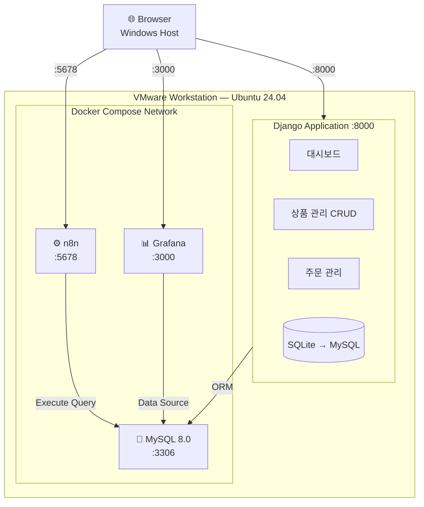
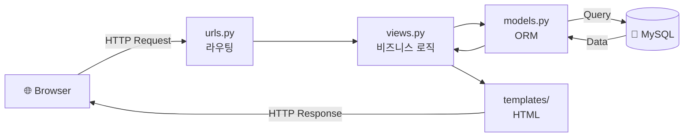
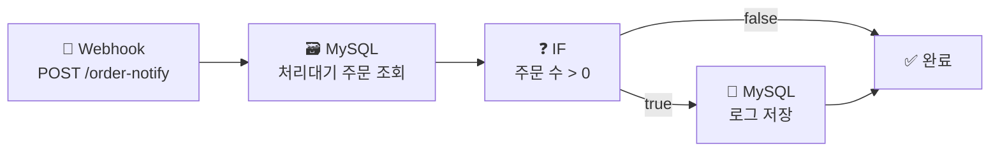
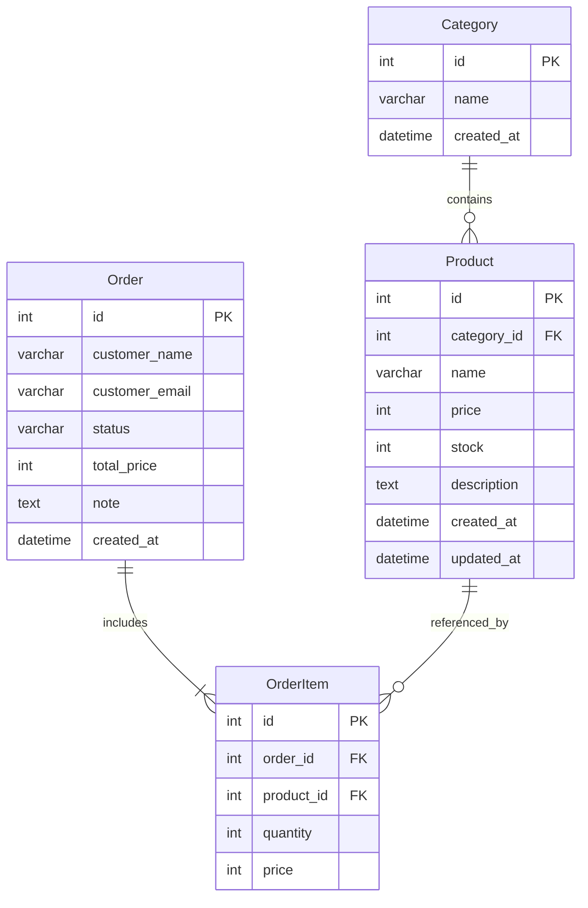
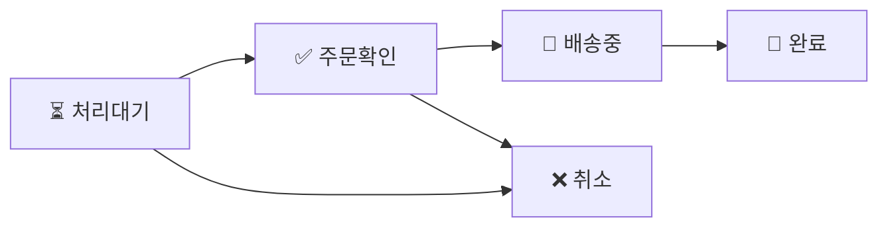
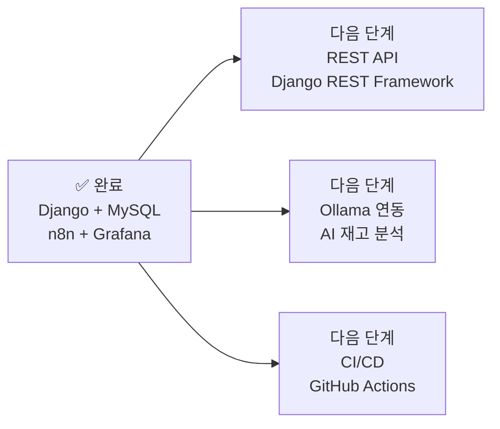

# Django + MySQL + n8n + Grafana 통합 프로젝트

> Ubuntu 24.04 (VMware Workstation) 환경에서  
> Django · MySQL · n8n · Grafana를 Docker Compose로 연동한 풀스택 DevOps 실습 프로젝트

---

## 목차

1. [프로젝트 개요](#1-프로젝트-개요)
2. [시스템 아키텍처](#2-시스템-아키텍처)
3. [개발 환경](#3-개발-환경)
4. [프로젝트 구조](#4-프로젝트-구조)
5. [데이터베이스 설계](#5-데이터베이스-설계)
6. [구현 내용](#6-구현-내용)
7. [주요 코드](#7-주요-코드)
8. [실행 방법](#8-실행-방법)
9. [동작 화면](#9-동작-화면)
10. [트러블슈팅](#10-트러블슈팅)

---

## 1. 프로젝트 개요

Django 웹 프레임워크 기반의 주문·재고 관리 시스템에 MySQL(Docker), n8n 워크플로우 자동화, Grafana 데이터 시각화를 연동한 통합 DevOps 실습 프로젝트입니다.

| 항목 | 내용 |
|------|------|
| 개발 환경 | Ubuntu 24.04 LTS (VMware Workstation) |
| 언어 | Python 3.12 |
| 웹 프레임워크 | Django 6.x |
| 데이터베이스 | MySQL 8.0 (Docker) |
| 워크플로우 자동화 | n8n (Docker) |
| 데이터 시각화 | Grafana (Docker) |
| 컨테이너 | Docker Compose |

---

## 2. 시스템 아키텍처

### 2.1 전체 시스템 구성



---

### 2.2 Django MVC 흐름



---

### 2.3 n8n 워크플로우



---

### 2.4 주문 등록 처리 흐름


---

### 2.5 데이터베이스 ERD



---

### 2.6 주문 상태 흐름



---

### 2.7 향후 계획



---

## 3. 개발 환경

### 3.1 시스템 사양

| 구분 | 내용 |
|------|------|
| Host OS | Windows 10/11 |
| Guest OS | Ubuntu 24.04 LTS |
| 가상화 | VMware Workstation 17+ |
| 네트워크 | NAT 모드 |

### 3.2 설치된 소프트웨어

```
Python        : 3.12
Django        : 6.0.4
mysqlclient   : 2.2.8
Docker        : 29.4.1
Docker Compose: v5.1.3
MySQL         : 8.0
n8n           : 2.17.7
Grafana       : latest
```

---

## 4. 프로젝트 구조

```
django-mysql-project/
├── docker-compose.yml         ← MySQL + n8n + Grafana
├── manage.py
├── mysite/
│   ├── settings.py            ← DB, ALLOWED_HOSTS 설정
│   └── urls.py                ← 전체 URL 라우팅
├── inventory/                 ← 주문·재고 관리 앱
│   ├── models.py              ← Category, Product, Order, OrderItem
│   ├── views.py               ← CRUD + Webhook 호출
│   ├── urls.py                ← 앱 URL 라우팅
│   ├── admin.py               ← 관리자 페이지
│   └── templates/
│       └── inventory/
│           ├── base.html
│           ├── dashboard.html
│           ├── product_list.html
│           ├── product_form.html
│           ├── order_list.html
│           ├── order_form.html
│           └── order_detail.html
└── venv/                      ← Python 가상환경
```

---

## 5. 데이터베이스 설계

### Django DB 테이블

| 테이블 | 설명 |
|--------|------|
| `inventory_category` | 상품 카테고리 |
| `inventory_product` | 상품 정보 (가격, 재고) |
| `inventory_order` | 주문 정보 (고객, 상태, 총금액) |
| `inventory_orderitem` | 주문 항목 (수량, 단가) |
| `workflow_logs` | n8n 워크플로우 실행 로그 |

### n8n MySQL Credential

| 항목 | 값 |
|------|-----|
| Host | `django_mysql` |
| Port | `3306` |
| Database | `django_db` |
| User | `djangouser` |
| Password | `djangopass` |

---

## 6. 구현 내용

### 6.1 Django 주문·재고 관리 시스템

| 기능 | URL | 메서드 |
|------|-----|--------|
| 대시보드 | `/inventory/` | GET |
| 상품 목록 | `/inventory/products/` | GET |
| 상품 등록 | `/inventory/products/new/` | GET/POST |
| 상품 수정 | `/inventory/products/<pk>/edit/` | GET/POST |
| 상품 삭제 | `/inventory/products/<pk>/delete/` | POST |
| 주문 목록 | `/inventory/orders/` | GET |
| 주문 등록 | `/inventory/orders/new/` | GET/POST |
| 주문 상세 | `/inventory/orders/<pk>/` | GET |
| 상태 변경 | `/inventory/orders/<pk>/status/` | POST |
| 관리자 | `/admin/` | GET |

### 6.2 n8n 워크플로우

- **Webhook** `POST /order-notify` 수신
- **MySQL** 처리대기 주문 조회 (`status='pending'`)
- **IF** 주문 수 > 0 조건 분기
- **MySQL** 로그 저장 (`workflow_logs` 테이블)

### 6.3 Grafana 대시보드 패널

| 패널 | 시각화 | 쿼리 대상 |
|------|--------|-----------|
| 전체 상품 수 | Stat | `inventory_product` |
| 재고 부족 상품 | Table | `inventory_product WHERE stock <= 5` |
| 주문 상태별 현황 | Pie chart | `inventory_order GROUP BY status` |
| n8n 워크플로우 로그 | Table | `workflow_logs` |

---

## 7. 주요 코드

### docker-compose.yml

```yaml
services:
  mysql:
    image: mysql:8.0
    container_name: django_mysql
    environment:
      MYSQL_ROOT_PASSWORD: rootpass
      MYSQL_DATABASE: django_db
      MYSQL_USER: djangouser
      MYSQL_PASSWORD: djangopass
    ports:
      - "3306:3306"
    networks:
      - app_net

  n8n:
    image: n8nio/n8n:latest
    container_name: django_n8n
    ports:
      - "5678:5678"
    environment:
      - N8N_SECURE_COOKIE=false
    networks:
      - app_net

  grafana:
    image: grafana/grafana:latest
    container_name: django_grafana
    ports:
      - "3000:3000"
    environment:
      - GF_SECURITY_ADMIN_USER=admin
      - GF_SECURITY_ADMIN_PASSWORD=admin123
    networks:
      - app_net

networks:
  app_net:
    driver: bridge
```

### Django settings.py — MySQL 연동

```python
DATABASES = {
    'default': {
        'ENGINE':   'django.db.backends.mysql',
        'NAME':     'django_db',
        'USER':     'djangouser',
        'PASSWORD': 'djangopass',
        'HOST':     '127.0.0.1',
        'PORT':     '3306',
        'OPTIONS': {
            'charset': 'utf8mb4',
        },
    }
}

ALLOWED_HOSTS = ['*']
```

### views.py — 주문 등록 + 재고 차감 + Webhook 호출

```python
def order_create(request):
    if request.method == 'POST':
        order = Order.objects.create(
            customer_name=request.POST['customer_name'],
            customer_email=request.POST['customer_email']
        )
        for pid, qty in zip(
            request.POST.getlist('product_id'),
            request.POST.getlist('quantity')
        ):
            qty = int(qty)
            product = Product.objects.get(pk=pid)
            OrderItem.objects.create(
                order=order, product=product,
                quantity=qty, price=product.price
            )
            product.stock -= qty      # 재고 자동 차감
            product.save()

        order.calc_total()            # 총금액 자동 계산

        # n8n Webhook 호출
        try:
            webhook_url = 'http://localhost:5678/webhook/order-notify'
            data = json.dumps({
                'order_id': order.pk,
                'customer': order.customer_name,
                'total':    order.total_price,
            }).encode('utf-8')
            req = urllib.request.Request(
                webhook_url, data=data,
                headers={'Content-Type': 'application/json'},
                method='POST'
            )
            urllib.request.urlopen(req, timeout=3)
        except Exception:
            pass

        return redirect('order_list')
```

### n8n 워크플로우 Webhook 테스트

```bash
curl -X POST http://localhost:5678/webhook/order-notify \
  -H "Content-Type: application/json" \
  -d '{"test": "order"}'
```

### Grafana 주요 쿼리

```sql
-- 전체 상품 수
SELECT COUNT(*) AS 전체상품수 FROM inventory_product;

-- 재고 부족 상품
SELECT name AS 상품명, stock AS 재고, price AS 단가
FROM inventory_product
WHERE stock <= 5
ORDER BY stock ASC;

-- 주문 상태별 현황
SELECT status AS 상태, COUNT(*) AS 건수
FROM inventory_order
GROUP BY status;

-- n8n 워크플로우 로그
SELECT created_at AS 시간, workflow AS 워크플로우,
       message AS 메시지, status AS 상태
FROM workflow_logs
ORDER BY created_at DESC
LIMIT 10;
```

---

## 8. 실행 방법

### 사전 준비

```bash
# Docker 설치
curl -fsSL https://get.docker.com -o get-docker.sh
sudo sh get-docker.sh
sudo usermod -aG docker $USER
sudo chmod 666 /var/run/docker.sock
```

### Docker Compose 실행

```bash
cd ~/django-mysql-project
docker compose up -d
docker compose ps
```

### Django 실행

```bash
cd ~/django-mysql-project
source venv/bin/activate
python manage.py migrate
python manage.py runserver 0.0.0.0:8000
```

### 접속 URL

| 서비스 | URL | 계정 |
|--------|-----|------|
| Django | http://Ubuntu-IP:8000/inventory/ | - |
| n8n | http://Ubuntu-IP:5678 | 설정한 계정 |
| Grafana | http://Ubuntu-IP:3000 | admin / admin123 |
| Django 관리자 | http://Ubuntu-IP:8000/admin/ | superuser |

---

## 9. 동작 화면

### 대시보드
- 전체 상품 수, 재고 부족, 품절, 주문 현황 통계 표시
- 최근 주문 5건 및 재고 부족 상품 목록

### 상품 관리
- 상품 등록/수정/삭제 (CRUD)
- 카테고리별 분류, 재고 상태 색상 표시 (정상/부족/품절)

### 주문 관리
- 다중 상품 주문 등록
- 주문 상태 필터링 (처리대기/주문확인/배송중/완료/취소)
- 드롭다운으로 빠른 상태 변경

### n8n 워크플로우
- Webhook → MySQL 조회 → IF 분기 → 로그 저장
- Executions 탭에서 실행 이력 확인

### Grafana 대시보드
- 전체 상품 수 (Stat)
- 재고 부족 상품 테이블 (Table)
- 주문 상태별 파이차트 (Pie chart)
- n8n 워크플로우 로그 (Table)

---

## 10. 트러블슈팅

### Docker 권한 오류
```
permission denied while trying to connect to the Docker daemon socket
```
**해결:**
```bash
sudo chmod 666 /var/run/docker.sock
sudo usermod -aG docker $USER
```

---

### Django ALLOWED_HOSTS 오류
```
DisallowedHost: Invalid HTTP_HOST header: '192.168.x.x:8000'
```
**해결:**
```python
# mysite/settings.py
ALLOWED_HOSTS = ['*']
```

---

### n8n Secure Cookie 오류
```
Your n8n server is configured to use a secure cookie
```
**해결:**
```yaml
# docker-compose.yml n8n environment
- N8N_SECURE_COOKIE=false
```

---

### Django include ImportError
```
NameError: name 'include' is not defined
```
**해결:**
```python
from django.urls import path, include
```

---

### n8n SQL 문법 오류
```
ER_PARSE_ERROR: You have an error in your SQL syntax
```
**원인:** 쿼리 내 작은따옴표 중첩 문제  
**해결:** 쿼리를 단순하게 수정
```sql
INSERT INTO workflow_logs (workflow, message, status)
VALUES ('order-notify', '처리대기 주문 발견', 'success');
```
