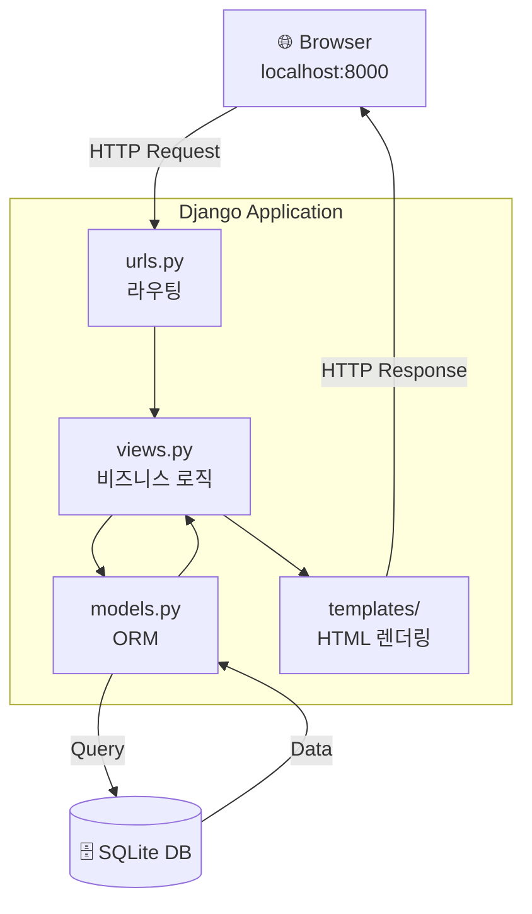
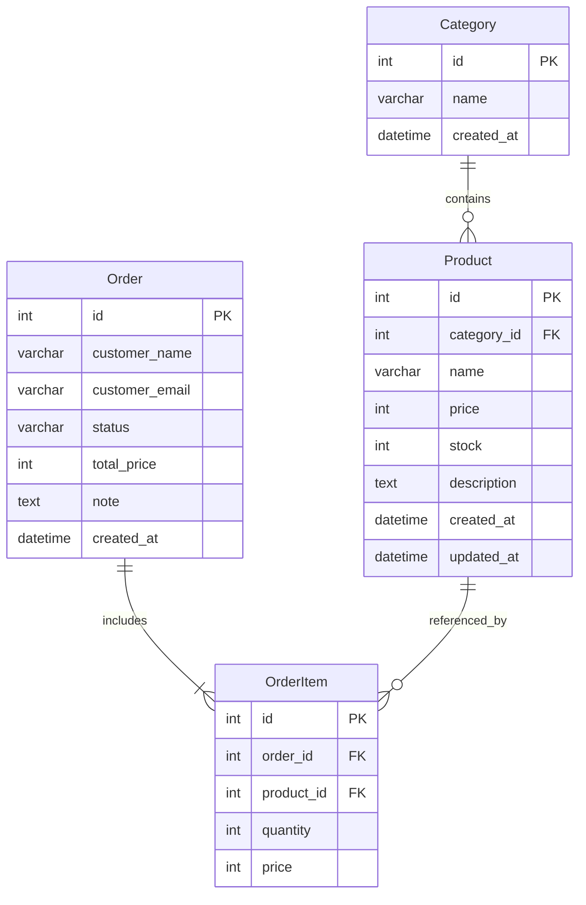
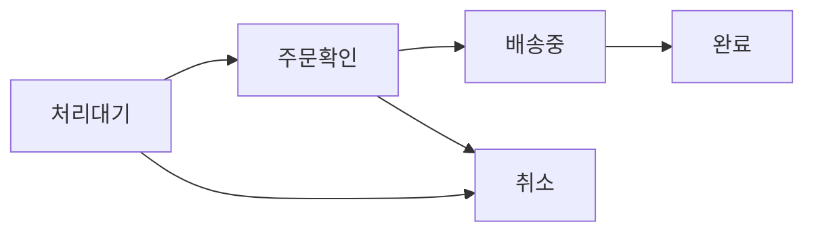

# 주문·재고 관리 시스템 보고서

> Ubuntu 24.04 (VMware Workstation) 환경에서  
> Django + Python으로 구현한 주문·재고 관리 웹 애플리케이션

---

## 목차

1. [프로젝트 개요](#1-프로젝트-개요)
2. [시스템 아키텍처](#2-시스템-아키텍처)
3. [개발 환경](#3-개발-환경)
4. [프로젝트 구조](#4-프로젝트-구조)
5. [데이터베이스 설계](#5-데이터베이스-설계)
6. [구현 기능](#6-구현-기능)
7. [주요 코드](#7-주요-코드)
8. [실행 방법](#8-실행-방법)
9. [향후 계획](#9-향후-계획)
10. [트러블슈팅](#10-트러블슈팅)

---

## 1. 프로젝트 개요

Django 웹 프레임워크를 사용하여 상품 재고 및 주문을 관리하는 웹 애플리케이션을 구현하였습니다.  
상품 등록·수정·삭제(CRUD), 주문 등록, 재고 자동 차감, 대시보드 기능을 포함합니다.

| 항목 | 내용 |
|------|------|
| 개발 환경 | Ubuntu 24.04 LTS (VMware Workstation) |
| 언어 | Python 3.12 |
| 프레임워크 | Django 5.x |
| 데이터베이스 | SQLite (기본) |
| 실행 포트 | 8000 |

---

## 2. 시스템 아키텍처



---

## 3. 개발 환경

### 설치 과정

```bash
# 1. Python 가상환경 생성
mkdir -p ~/django-project
cd ~/django-project
python3 -m venv venv
source venv/bin/activate

# 2. Django 설치
pip install django

# 3. 프로젝트 생성
django-admin startproject mysite .

# 4. 앱 생성
python manage.py startapp blog
python manage.py startapp inventory

# 5. 마이그레이션
python manage.py makemigrations inventory
python manage.py migrate
```

### 가상환경 관리

```bash
source venv/bin/activate   # 활성화
deactivate                  # 비활성화
pip freeze > requirements.txt
```

---

## 4. 프로젝트 구조

```
django-project/
├── manage.py
├── mysite/
│   ├── settings.py        ← 앱 등록, DB 설정
│   └── urls.py            ← 전체 URL 라우팅
├── blog/                  ← 기본 실습 앱
│   ├── views.py           ← index, hello, data(JSON API)
│   ├── urls.py
│   └── templates/
│       └── blog/
│           ├── index.html
│           └── hello.html
└── inventory/             ← 주문·재고 관리 앱
    ├── models.py          ← Category, Product, Order, OrderItem
    ├── views.py           ← CRUD 뷰 함수
    ├── urls.py            ← 앱 URL 라우팅
    ├── admin.py           ← 관리자 페이지 등록
    └── templates/
        └── inventory/
            ├── base.html          ← 공통 레이아웃 (사이드바)
            ├── dashboard.html     ← 통계 대시보드
            ├── product_list.html  ← 상품 목록 + 검색
            ├── product_form.html  ← 상품 등록/수정 폼
            ├── order_list.html    ← 주문 목록 + 상태 필터
            ├── order_form.html    ← 주문 등록 폼
            └── order_detail.html  ← 주문 상세 + 상태 변경
```

---

## 5. 데이터베이스 설계



### 주문 상태 흐름



---

## 6. 구현 기능

### 6.1 대시보드

| 표시 항목 | 설명 |
|-----------|------|
| 전체 상품 수 | Product 테이블 전체 count |
| 재고 부족 | stock ≤ 5인 상품 수 |
| 품절 | stock = 0인 상품 수 |
| 전체 주문 수 | Order 테이블 전체 count |
| 처리 대기 | status = 'pending' 주문 수 |
| 오늘 주문 | 오늘 날짜 주문 수 |
| 최근 주문 5건 | 최신순 주문 목록 |
| 재고 부족 상품 | stock 오름차순 상위 5개 |

### 6.2 상품 관리 (CRUD)

| 기능 | URL | 메서드 |
|------|-----|--------|
| 목록 + 검색 | `/inventory/products/` | GET |
| 등록 | `/inventory/products/new/` | GET / POST |
| 수정 | `/inventory/products/<pk>/edit/` | GET / POST |
| 삭제 | `/inventory/products/<pk>/delete/` | POST |

### 6.3 주문 관리

| 기능 | URL | 메서드 |
|------|-----|--------|
| 목록 + 상태 필터 | `/inventory/orders/` | GET |
| 등록 | `/inventory/orders/new/` | GET / POST |
| 상세 | `/inventory/orders/<pk>/` | GET |
| 상태 변경 | `/inventory/orders/<pk>/status/` | POST |

---

## 7. 주요 코드

### models.py — 핵심 모델

```python
class Product(models.Model):
    category    = models.ForeignKey(Category, on_delete=models.SET_NULL, null=True)
    name        = models.CharField(max_length=200)
    price       = models.IntegerField()
    stock       = models.IntegerField(default=0)
    description = models.TextField(blank=True)
    created_at  = models.DateTimeField(auto_now_add=True)
    updated_at  = models.DateTimeField(auto_now=True)

class Order(models.Model):
    STATUS_CHOICES = [
        ('pending',   '처리대기'),
        ('confirmed', '주문확인'),
        ('shipping',  '배송중'),
        ('completed', '완료'),
        ('cancelled', '취소'),
    ]
    customer_name  = models.CharField(max_length=100)
    customer_email = models.EmailField()
    status         = models.CharField(max_length=20, choices=STATUS_CHOICES, default='pending')
    total_price    = models.IntegerField(default=0)

    def calc_total(self):
        self.total_price = sum(item.subtotal for item in self.orderitem_set.all())
        self.save()

class OrderItem(models.Model):
    order    = models.ForeignKey(Order, on_delete=models.CASCADE)
    product  = models.ForeignKey(Product, on_delete=models.CASCADE)
    quantity = models.IntegerField()
    price    = models.IntegerField()

    @property
    def subtotal(self):
        return self.price * self.quantity
```

### views.py — 주문 등록 (재고 자동 차감)

```python
def order_create(request):
    if request.method == 'POST':
        order = Order.objects.create(
            customer_name=request.POST['customer_name'],
            customer_email=request.POST['customer_email']
        )
        for pid, qty in zip(
            request.POST.getlist('product_id'),
            request.POST.getlist('quantity')
        ):
            qty = int(qty)
            product = Product.objects.get(pk=pid)

            # 주문 항목 생성
            OrderItem.objects.create(
                order=order, product=product,
                quantity=qty, price=product.price
            )
            # 재고 자동 차감
            product.stock -= qty
            product.save()

        order.calc_total()   # 총금액 자동 계산
        return redirect('order_list')
```

### blog/views.py — JSON API

```python
def data(request):
    numbers = [random.randint(1, 100) for _ in range(10)]
    return JsonResponse({
        'numbers': numbers,
        'sum':     sum(numbers),
        'average': round(sum(numbers) / len(numbers), 2),
        'max':     max(numbers),
        'min':     min(numbers),
        'time':    datetime.datetime.now().strftime('%Y-%m-%d %H:%M:%S')
    })
```

---

## 8. 실행 방법

```bash
# 1. 프로젝트 폴더 이동
cd ~/django-project

# 2. 가상환경 활성화
source venv/bin/activate

# 3. 마이그레이션 (최초 1회)
python manage.py makemigrations inventory
python manage.py migrate

# 4. 관리자 계정 생성 (최초 1회)
python manage.py createsuperuser

# 5. 서버 실행
python manage.py runserver
```

### 접속 URL

| 서비스 | URL |
|--------|-----|
| 메인 페이지 | http://localhost:8000 |
| JSON API | http://localhost:8000/data/ |
| 재고 대시보드 | http://localhost:8000/inventory/ |
| 상품 목록 | http://localhost:8000/inventory/products/ |
| 주문 목록 | http://localhost:8000/inventory/orders/ |
| 관리자 페이지 | http://localhost:8000/admin/ |

---

## 9. 향후 계획


| 단계 | 내용 | 사용 기술 |
|------|------|-----------|
| 1단계 | DB를 SQLite → MySQL로 전환 | `mysqlclient`, Django DB 설정 |
| 2단계 | 주문 등록 시 n8n으로 자동 알림 | n8n Webhook, HTTP Request |
| 3단계 | Grafana에서 주문·재고 대시보드 | Grafana, MySQL DataSource |

---

## 10. 트러블슈팅

### `include` is not defined

```
NameError: name 'include' is not defined
```

**원인:** `urls.py`에서 `include` import 누락  
**해결:**
```python
from django.urls import path, include
```

---

### `No module named 'inventory.urls'`

```
ModuleNotFoundError: No module named 'inventory.urls'
```

**원인:** `inventory/urls.py` 파일 미생성  
**해결:**
```bash
nano ~/django-project/inventory/urls.py
# urls.py 내용 직접 작성
```

---

### `cannot import name 'views'`

```
ImportError: cannot import name 'views' from 'inventory'
```

**원인:** `inventory/views.py` 파일 미생성  
**해결:**
```bash
nano ~/django-project/inventory/views.py
# views.py 내용 직접 작성
```

---

### `TemplateDoesNotExist`

```
TemplateDoesNotExist at /inventory/
inventory/dashboard.html
```

**원인:** templates 폴더 구조 미생성  
**해결:**
```bash
mkdir -p ~/django-project/inventory/templates/inventory
# 각 html 파일 직접 생성
```

---

### 가상환경 비활성화 상태에서 실행

```
ModuleNotFoundError: No module named 'django'
```

**원인:** 가상환경 활성화 없이 명령어 실행  
**해결:**
```bash
source venv/bin/activate
# (venv) 프롬프트 확인 후 실행
```
